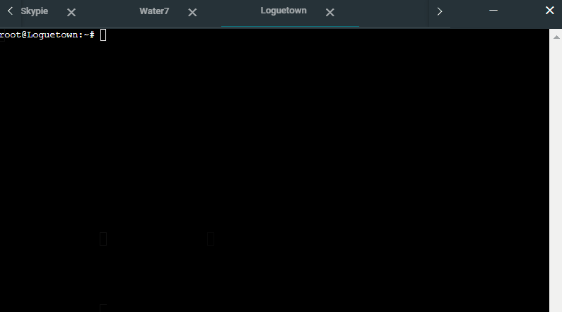

# Jarkom-Modul-3-C08-2021

Berikut adalah laporan resmi Praktikum Jaringan Komputer Modul 2 tahun 2021

Anggota Kelompok C08 :

- 05111940000100 - Muhammad Raihan
- 05111940000208 - Inez Yulia Amanda
- 05111940000209 - Refaldyka Galuh Pratama

### 1. Luffy bersama Zoro berencana membuat peta tersebut dengan kriteria EniesLobby sebagai DNS Server, Jipangu sebagai DHCP Server, Water7 sebagai Proxy Server

### 2. Foosha sebagai DHCP Relay

### 3. Semua client yang ada HARUS menggunakan konfigurasi IP dari DHCP Server. Client yang melalui Switch1 mendapatkan range IP dari 10.18.1.20 - 10.18.1.99 dan 10.18.1.150 - 10.18.1.169

### 4. Client yang melalui Switch3 mendapatkan range IP dari 10.18.3.30 - 10.18.3.50

### 5. Client mendapatkan DNS dari EniesLobby dan client dapat terhubung dengan internet melalui DNS tersebut.

### 6. Lama waktu DHCP server meminjamkan alamat IP kepada Client yang melalui Switch1 selama 6 menit sedangkan pada client yang melalui Switch3 selama 12 menit. Dengan waktu maksimal yang dialokasikan untuk peminjaman alamat IP selama 120 menit.

### 7. Luffy dan Zoro berencana menjadikan Skypie sebagai server untuk jual beli kapal yang dimilikinya dengan alamat IP yang tetap dengan IP 10.18.3.69

### 8. Pada Loguetown, proxy harus bisa diakses dengan nama jualbelikapal.c08.com dengan port yang digunakan adalah 5000

1. Masukkan command berikut pada `EniesLobby`

   ```
   vim /etc/bind/named.conf.local
   ```

2. Isikan configurasi zone domain **franky.c08.com** sesuai dengan syntax berikut:

   ```
   zone "jualbelikapal.c08.com" {
     type master;
     file "/etc/bind/kaizoku/jualbelikapal.c08.com";
   };
   ```

3. Copykan file `db.local` pada path `/etc/bind` ke dalam folder **kaizoku** yang baru saja dibuat dan ubah namanya menjadi **jualbelikapal.c08.com**

4. Buka file **jualbelikapal.c08.com** dan edit seperti gambar berikut. ( IP mengarah ke Skypie )
   

5. Restart bind9 pada `Enieslobby` dengan command `service bind9 restart`

6. Pada Skypie, pindah ke direktori `/etc/apache2/sites-available` lalu _copy_ file **000-default.conf** ke **jualbelikapal.c08.com.conf** dengan perintah

   ```
   cp /etc/apache2/sites-available/000-default.conf /etc/apache2/sites-available/franky.c08.com.conf
   ```

7. Edit file **jualbelikapal.c08.com.conf** sehingga menjadi
   

8. Masukkan command berikut pada `Water7`

   ```
   vim /etc/squid/squid.conf
   ```

9. Tambahkan syntax berikut pada konfigurasi squid

   ```
   http_port 5000
   visible_hostname jualbelikapal.c08.com
   http_access allow all
   ```

10. Restart squid dengan command `service squid restart` dan jalankan command `lynx google.com` maka akan tampil homepage google.

### 9. Agar transaksi jual beli lebih aman dan pengguna website ada dua orang, proxy dipasang autentikasi user proxy dengan enkripsi MD5 dengan dua username, yaitu luffybelikapalc08 dengan password luffy_c08 dan zorobelikapalc08 dengan password zoro_c08

1. Install `apache2-utils` pada Water7.

2. Buat user baru dengan command

   ```
   htpasswd -c /etc/squid/passwd luffybelikapalc08
   ```

   dan ketikkan password **luffy_c08**.
   Lakukan sekali lagi untuk zoro dengan command

   ```
   htpasswd -m /etc/squid/passwd zorobelikapalc08
   ```

   dan ketikkan password **zoro_c08**.

3. Masukkan command berikut pada `Water7`

   ```
   vim /etc/squid/squid.conf
   ```

4. Tambahkan syntax berikut pada konfigurasi squid
   ```
   auth_param basic program /usr/lib/squid/basic_ncsa_auth /etc/squid/passwd
   auth_param basic children 5
   auth_param basic realm Proxy
   auth_param basic credentialsttl 2 hours
   auth_param basic casesensitive on
   acl USERS proxy_auth REQUIRED
   ```
5. Restart squid dengan command `service squid restart` dan coba akses sebuah laman website maka tampilannya sebagai berikut
   

### 10. Transaksi jual beli tidak dilakukan setiap hari, oleh karena itu akses internet dibatasi hanya dapat diakses setiap hari Senin-Kamis pukul 07.00-11.00 dan setiap hari Selasa-Jum’at pukul 17.00-03.00 keesokan harinya (sampai Sabtu pukul 03.00)

1. Masukkan command berikut pada `Water7 `

   ```
   vim /etc/squid/acl.conf
   ```

2. Isi konfigurasi sesuai syntax berikut
   ```
   acl AVAILABLE_WORKING time MTWH 07:00-11:00
   acl AVAILABLE_WORKING1 time TWHF 17:00-24:00
   acl AVAILABLE_WORKING2 time WHFA 00:00-03:00
   ```

3. Masukkan command berikut pada `Water7 `

   ```
   vim /etc/squid/squid.conf
   ```

4. Tambahkan syntax berikut
    ```
    include /etc/squid/acl.conf
    http_access allow AVAILABLE_WORKING USERS
    http_access allow AVAILABLE_WORKING1 USERS
    http_access allow AVAILABLE_WORKING2 USERS
    http_access deny all
    ```
    dan hapus syntax ini pada konfigurasi squid
    ```
    http_access allow all
    ```

5. Restart squid dengan command `service squid restart` dan coba akses sebuah laman website maka tampilannya sebagai berikut :
    > Jika mengakses di luar jam akses
    

    > Jika mengakses dalam range jam akses
    

### 11. Agar transaksi bisa lebih fokus berjalan, maka dilakukan redirect website agar mudah mengingat website transaksi jual beli kapal. Setiap mengakses google.com, akan diredirect menuju super.franky.c08.com dengan website yang sama pada soal shift modul 2. Web server super.franky.c08.com berada pada node Skypie

1. Masukkan command berikut pada `EniesLobby`

```
vim /etc/bind/named.conf.local
```

2. Isikan configurasi zone domain **franky.c08.com** sesuai dengan syntax berikut:

```
zone "franky.c08.com" {
	type master;
	file "/etc/bind/kaizoku/franky.c08.com";
};
```

3. Copykan file `db.local` pada path `/etc/bind` ke dalam folder **kaizoku** yang baru saja dibuat dan ubah namanya menjadi **franky.c08.com**
4. Buka file **franky.c08.com** dan edit seperti gambar beriku. ( IP mengarah ke Skypie )
   
5. Restart bind9 pada `Enieslobby` dengan command `service bind9 restart`
6. Pindah ke direktori `/etc/apache2/sites-available` lalu _copy_ file **000-default.conf** ke **franky.c08.com.conf** dengan perintah
   ```
   cp /etc/apache2/sites-available/000-default.conf /etc/apache2/sites-available/franky.c08.com.conf
   ```
7. Edit file **franky.c08.com.conf** sehingga menjadi
   
8. Pindah ke direktori `/root` lalu download file yang franky dan super.franky pada https://github.com/FeinardSlim/Praktikum-Modul-2-Jarkom dengan command `wget` dan unzip filenya
9. Buat directory `/var/www/franky.c08.com` dan `/var/www/super.franky.c08.com` dengan command `mkdir`
10. Copykan file yang sudah diunzip pada `/root` sesuai dengan directory yang dibikin
11. Aktifkan konfigurasi dengan menggunakan command `a2ensite franky.c08.com.conf`
12. Matikan konfigurasi **000-default.conf** dengan menggunakan command `a2dissite 000-default.conf`
13. Masukkan command berikut pada `Water7`

```
vim /etc/squid/squid.conf
```

14. Tambahkan syntax berikut pada konfigurasi squid

```
acl badsites dstdomain google.com
acl badsites dstdomain .www.google.com
http_access deny AVAILABLE_WORKING badsites
http_access deny AVAILABLE_WORKING1 badsites
http_access deny AVAILABLE_WORKING2 badsites
deny_info http://super.franky.c08.com badsites
```

15. restart squid dengan command `service squid restart`
16. Jika sudah yang akan terjadi seperti pada `.gif` berikut
    

### 12. Luffy dan Zoro akhirnya memutuskan untuk berlayar untuk mencari harta karun di super.franky.c08.com. Tugas pencarian dibagi menjadi dua misi, Luffy bertugas untuk mendapatkan gambar (.png, .jpg), sedangkan Zoro mendapatkan sisanya. Karena Luffy orangnya sangat teliti untuk mencari harta karun, ketika ia berhasil mendapatkan gambar, ia mendapatkan gambar dan melihatnya dengan kecepatan 10 kbps

1. Masukkan command berikut pada `Water7`

```
vim /etc/squid/squid.conf
```

2. Tambahkan syntax berikut pada konfigurasi squid

```
acl download url_regex -i \.png$ \.jpg$
delay_pools 1
delay_class 1 1
delay_parameters 1 10000/10000
delay_access 1 allow download
delay_access 1 deny all
```

3. restart squid dengan command `service squid restart`
4. Jika sudah, tes kecepatan download file dengan menggunakan _username_ dan _password_ luffy
   

### 13. Sedangkan, Zoro yang sangat bersemangat untuk mencari harta karun, sehingga kecepatan kapal Zoro tidak dibatasi ketika sudah mendapatkan harta yang diinginkannya

1. Masukkan command berikut pada `Water7`

```
vim /etc/squid/squid.conf
```

2. Ubah syntax sebelumnya menjadi berikut pada konfigurasi squid

```
acl download url_regex -i \.png$ \.jpg$
acl user2 proxy_auth zorobelikapalc08
delay_pools 2
delay_class 1 1
delay_parameters 1 -1/-1
delay_access 1 allow user2
delay_access 1 deny all
delay_class 2 1
delay_parameters 2 10000/10000
delay_access 2 allow download
delay_access 2 deny all
```

3. restart squid dengan command `service squid restart`
4. Jika sudah, tes kecepatan download file dengan menggunakan _username_ dan _password_ zoro
   
